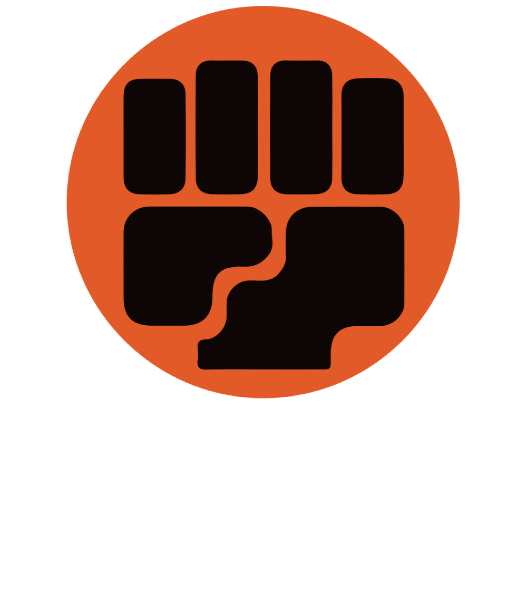

    

# Incipit
Elemental fighters is a small 2D "mortal kombat style" game, playable only on the same keyboard (for the moment). Developed mainly for learning javascript and html canvas.
    
This project has no great ambition, will be carried out in my free time. 

Any suggestion/issue/pull-request are appreciated.

# How to play
The game can be played here:

### Comands for Player 1 on the left
  - `a`: move to the left
  - `d`: move to the right
  - `w`: jump
  - `s`: defend
  - `space bar`: attack
  - `a - a` (double tap): roll to the left
  - `d - d` (double tap): roll to the right

### Comands for Player 2 on the right
  - `Left Arrow`: move to the left
  - `Right Arrow`: move to the right
  - `Arrow Up`: jump
  - `Arrow Down`: defend
  - `0`: attack
  - `Left Arrow - Left Arrow` (double tap): roll to the left
  - `Right Arrow - Right Arrow` (double tap): roll to the right

## Credits
The project has no commercial purpose. I do not own any graphical asset:

- Fighters assets are made by [chierit](https://chierit.itch.io)
- Background is made by [edermunizz](https://edermunizz.itch.io)

